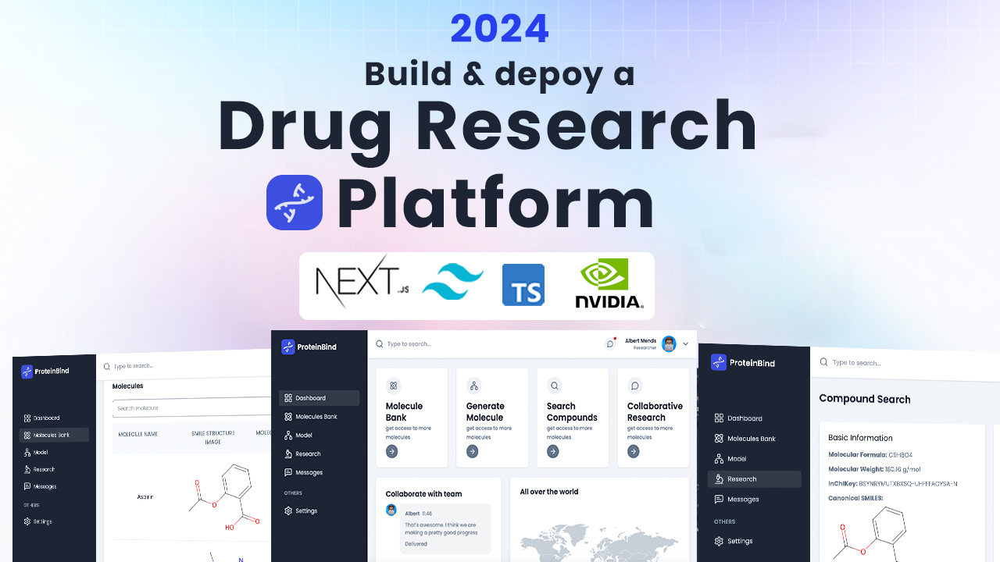

<div align="center">
  <br />
    <a href="https://www.youtube.com/channel/UC-YsuP1JJVYUj9ivM9uBtEQ" target="_blank">
      
    </a>
  
  <br />

  <div>
    
    
    
    
  </div>

  <h3 align="center">ProteinBind</h3>

   <div align="center">
     Build this project step by step with our detailed tutorial on <a href="https://www.youtube.com/@albertmends" target="_blank"><b>Your YouTube Channel</b></a>. Join the community!
    </div>
</div>

## 📋 <a name="table">Table of Contents</a>

1. 🤖 [Introduction](#introduction)
2. ⚙️ [Tech Stack](#tech-stack)
3. 🔋 [Features](#features)
4. 🤸 [Quick Start](#quick-start)
5. 🧬 [Protein Data Processing](#protein-data)
6. 🚀 [More](#more)

## 🚨 Tutorial

This repository contains the code corresponding to an in-depth tutorial available on our YouTube channel, <a href="https://www.youtube.com/@albertmends/videos" target="_blank"><b>Code with Albert</b></a>.

If you prefer visual learning, this is the perfect resource for you. Follow our tutorial to learn how to build projects like these step-by-step in a beginner-friendly manner!

## <a name="introduction">🤖 Introduction</a>

**ProteinBind** is a drug discovery and protein-binding prediction tool built with the latest in machine learning and natural language processing (NLP) technology. Powered by NVIDIA NIM and protein structure prediction models, this project enables users to simulate molecular interactions and predict protein structures.

The platform is designed to help researchers accelerate drug discovery by leveraging cutting-edge AI models for protein folding, docking, and molecular dynamics.

If you're getting started and need assistance or face any bugs, join our active Discord community. It's a place where people help each other out.

<a href="https://discord.com/channels/1221368900579754074/1221368901162631243" target="_blank"></a>

## <a name="tech-stack">⚙️ Tech Stack</a>

- **Next.js**
- **TypeScript**
- **NVIDIA** (for protein structure prediction)
- **Tailwind CSS**
- **React Chart.js** (for visualizing protein data)

## <a name="features">🔋 Features</a>

👉 **Protein Structure Prediction**: Predicts 2D protein structures using NVIDIA models.

👉 **Collaborative Research**: Researches can create groups and colloborate with other research online

👉 **Responsive Design**: Ensures seamless experience across all devices, from desktops to mobile.

## <a name="quick-start">🤸 Quick Start</a>

Follow these steps to set up the project locally on your machine.

### **Prerequisites**

Make sure you have the following installed on your machine:

- [Git](https://git-scm.com/)
- [Node.js](https://nodejs.org/en)
- [npm](https://www.npmjs.com/) (Node Package Manager)

### **Cloning the Repository**

```bash
git clone https://github.com/mendsalbert/ProteinBind.git
cd proteinbind
```

### **Installation**

Install the project dependencies using npm:

```bash
npm install
```

### **Set Up Environment Variables**

Create a new file named `.env` in the root of your project and add the following content:

```env
NEXT_PUBLIC_NVIDIA_API_KEY=your-nvidia-api-key

ABLY_API_KEY='your-ably-api-key'

MONGODB_URL='your-mongodb-url'

NEXT_PUBLIC_API_BASE_URL=http://localhost:3000

RESEND_KEY='your-resend-api-key'
```

### **Running the Project**

```bash
npm run dev
```

Open [http://localhost:3000](http://localhost:3000) in your browser to view the project.

## <a name="protein-data">🧬 Protein Data Processing</a>

This section covers the protein data processing pipeline, including loading protein structure files (e.g., PDB format), performing molecular docking simulations, and visualizing the results.

### **Protein Structure Input**

Users can upload PDB files for protein structures, which will then be processed by NVIDIA NeMo's protein-folding models.

### **Docking Simulation**

Using molecular docking algorithms, the system predicts how small molecules (such as drug candidates) bind to protein targets.

## <a name="more">🚀 More</a>

Stay tuned for more updates and features! Join our community, contribute to the repository, and follow along with our detailed tutorials.

## 📞 **Contact & Community**

If you have any questions or need support, feel free to join our Discord server or contact us through GitHub Discussions.

<a href="https://discord.com/channels/1221368900579754074/1221368901162631243" target="_blank">Join Discord</a> | <a href="https://github.com/mendsalbert/proteinbind/discussions" target="_blank">GitHub Discussions</a>
